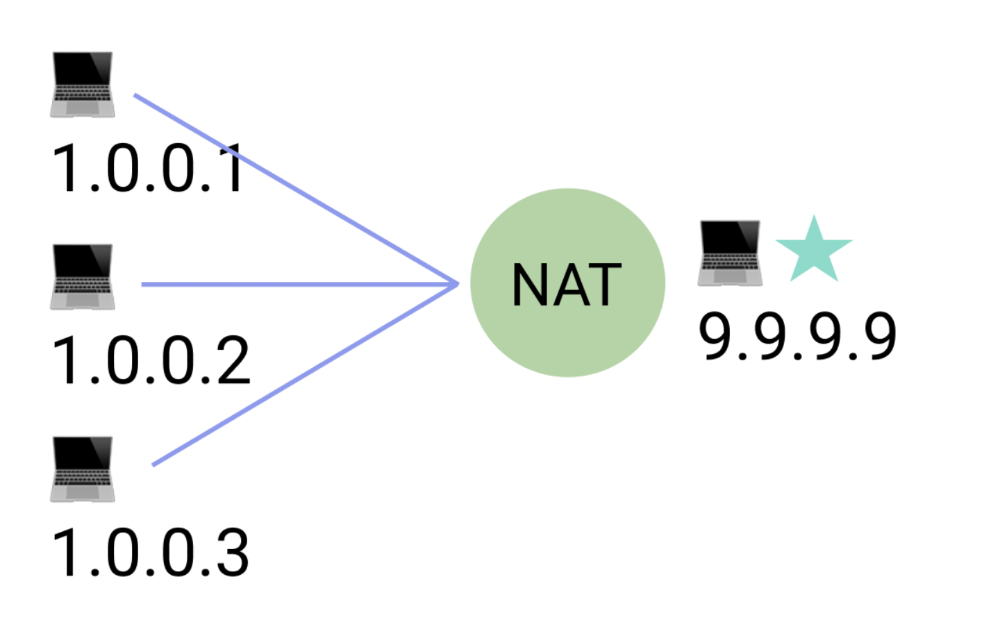

스마일게이트 윈터데브캠프에서 WebRTC를 이용한 화상회의플랫폼을 제작하면서 필요한 WebRTC 개념을 정리합니다.

# WebRTC란?

---

Web Real-Time Communication의 약자입니다.
웹 어플리케이션이 ==별도의 소프트웨어 없이== 데이터를 브라우저끼리 주고 받을 수 있는 기술입니다.
음성, 영상, 텍스트, 파일 등을 공유할 수 있습니다.

# 네트워크 용어

---

통신 과정 이해에 필요한 네트워크 용어를 먼저 알아봅시다.

## NAT

Netwrok Address Translation의 약자입니다.
라우터 등의 장비를 통해 다수의 private IP를 하나의 public IP로 변환하는 기술입니다.

private IP 를 외부에서 알수 없기 때문에 보안성이 높다는 ==장점==이 있습니다.
private IP 를 외부에서 알수 없기 때문에 서버 입장에서 외부의 클라이언트에게 패킷을 전송할 방법이 없다는 ==단점==이 있습니다.


## NAT travelsal

.

## STUN

Session Traversal Utilities for NAT의 약자입니다.
public에 위치하고, 요청을 보낸 클라이언트의 public IP address와 port를 알려주는 역할을 합니다.

## TURN

Traversal Using Relays around NAT의 약자입니다.
**네트워크 트래픽을 Relay 시켜주는 역할**을 합니다.

클라이언트는 서버에 Relay Allocation Request을 전송합니다.
TURN 서비스는 이 allocation에 대한 transport address를 예약하게 되는데, 바로 이 주소가 relay transport address가 됩니다.
이때, 클라이언트는 relay candidate를 획득하며, 사용 중인 시그널링 시스템을 사용하여 통신 상대에게 이를 전송합니다.
클라이언트들이 전송한 RTP 패킷을 relay합니다.

TURN 서버와 관련된 리소스는 매우 비싸기 때문에 대부분은 **인증**이 필요합니다.
TURN 서버에 트래픽이 몰리기 때문에 **마지막 수단**으로 사용해야 합니다.

## ICE

Interactive Connectivity Establishment의 약자입니다.
ICE는 미디어와 데이터를 교환할 때 적합한 ICE candidate를 동적으로 찾아내는 프로세스입니다.
ICE candidate는 IP와 Port, 그리고 TCP/UDP 등의 프로토콜로 이뤄져 있는 transport address를 의미합니다.

ICE candidate는 3가지로 나뉩니다.

- local address : 클라이언트의 private IP
- server reflexive address : NAT 장비가 매핑한 클라이언트의 public IP
- relayed address : TURN 서버가 패킷 릴레이를 위해 할당한 relay transport address

ICE는 ICE candidate를 수집하고, 각 candidate에 패킷을 송수신해서 각 경로에서 품질이 우수한 것을 사용합니다.

## SDP

.

## RTP

Real-time Transport Protocol의 약자입니다.
일반적으로 UDP로 동작합니다.
IP 멀티캐스트를 통해 여러 수신자에 데이터를 전송할 수 있게 합니다.

## Signaling

.

# Peer Connection Process

---

.

# Architecture

---

연

## Mesh

.

## SFU

.

## MCU

.

# API

---

.

# Question

---

```text
Q. 원래 이런거 필요없이도 서버에 요청 잘됐는데 WebRTC는 왜 STUN, TURN 같은 게 필요할까?

A. client가 연결을 init할 때는 요청한 패킷에서 public IP를 알 수 있으니까 필요 없습니다.
서버가 연결을 init할 때는 필요합니다. 서버는 클라이언트의 IP를 모르기 때문에 STUN, TURN을 이용하여 클라이언트의 public IP를 알아내는 과정이 필요합니다.
```
